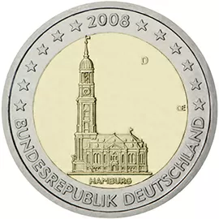

# Germany € 2.00

## Images

## Metadata

**Country:** [Germany](../../Countries/Germany/index.md)\
**Serie:** [German federal states](index.md)\
**Monetary value:** € 2.00\
**Currency:** Euro

## Description

Federal state of Hamburg

## Mintages

| Year | Mintmark | Circulated | Brilliant Uncirculated | Proof  |
| ---- | -------- | ---------- | ---------------------- | ------ |
| 2008 | A        | 1000000    | 0                      | 116000 |
| 2008 | D        | 8900000    | 0                      | 116000 |
| 2008 | F        | 9675000    | 0                      | 116000 |
| 2008 | G        | 4200000    | 0                      | 116000 |
| 2008 | J        | 6300000    | 0                      | 116000 |
