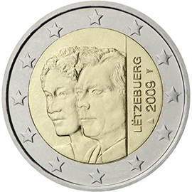

# Luxembourg € 2.00

## Images

## Metadata

**Country:** [Luxembourg](../../Countries/Luxembourg/index.md)\
**Monetary value:** € 2.00\
**Currency:** Euro

## Description
Grand-Duke Henri and Grand-Duchess Charlotte

## Mintages

| Year | Mintmark | Circulated | Brilliant Uncirculated | Proof |
| ---- | -------- | ---------- | ---------------------- | ----- |
| 2009 | | 0 | 0 | 0 |
