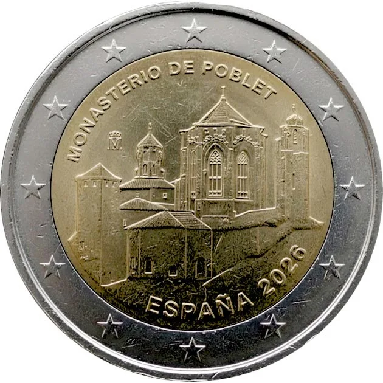

# Spain € 2.00

## Images

## Metadata

**Country:** [Spain](../../Countries/Spain/index.md)\
**Serie:** [Spanish UNESCO World Heritage](index.md)\
**Monetary value:** € 2.00\
**Currency:** Euro\
**Issue date:**\
**Designer:**

## Description

Poblet Monastery

## Mintages

| Year | Mintmark | Circulated | Brilliant Uncirculated | Proof |
| ---- | -------- | ---------- | ---------------------- | ----- |
| 2026 |          | 0          | 8000                   | 6500  |

### Sources

- Mintages [Uncirculated in year set](https://tienda.fnmt.es/fnmttv/fnmt/en/Products/Coins/EUROSET-SPAIN-2026/p/32107210)
- Mintages [Proof](https://tienda.fnmt.es/fnmttv/fnmt/en/Products/Coins/Web/Eurosets-2026/2-EURO-PROOF-POBLET-2026/p/32107212), [Proof in year set](https://tienda.fnmt.es/fnmttv/fnmt/en/Products/Coins/Web/Eurosets-2026/EUROSET-2026-PROOF/p/32777107?utm_source=newsletter&utm_medium=email&utm_campaign=euroset-proof-2026)
