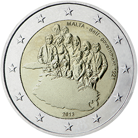

# Malta € 2.00

## Images

## Metadata

**Country:** [Malta](../../Countries/Malta/index.md)\
**Serie:** [Maltese Constitutional History](index.md)\
**Monetary value:** € 2.00\
**Currency:** Euro\
**Issue date:** 2013-06-24

## Description

The Self-Government Constitution of 1921

## Mintages

| Year | Mintmark | Circulated | Brilliant Uncirculated | Proof |
| ---- | -------- | ---------- | ---------------------- | ----- |
| 2013 |          | 0          | 500000                 | 15000 |
