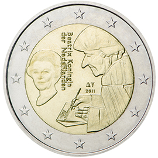

# The Netherlands € 2.00

## Images

## Metadata

**Country:** [The Netherlands](../../Countries/The Netherlands/index.md)\
**Monetary value:** € 2.00\
**Currency:** Euro

## Description
The 500th anniversary of the publication of the world-famous book "Laus Stultitiae" by the Dutch philosopher, humanist and theologian Desiderius Erasmus

## Mintages

| Year | Mintmark | Circulated | Brilliant Uncirculated | Proof |
| ---- | -------- | ---------- | ---------------------- | ----- |
| 2011 | | 0 | 0 | 0 |
