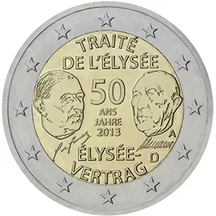

# Germany € 2.00

## Images

## Metadata

**Country:** [Germany](../../Countries/Germany/index.md)\
**Serie:** [Élysée treaty](index.md)\
**Monetary value:** € 2.00\
**Currency:** Euro

## Description

50 years Élysée treaty

## Mintages

| Year | Mintmark | Circulated | Brilliant Uncirculated | Proof |
| ---- | -------- | ---------- | ---------------------- | ----- |
| 2013 | A        | 2200000    | 0                      | 81000 |
| 2013 | D        | 2310000    | 0                      | 81000 |
| 2013 | F        | 2640000    | 0                      | 81000 |
| 2013 | G        | 1540000    | 0                      | 81000 |
| 2013 | J        | 2310000    | 0                      | 81000 |
