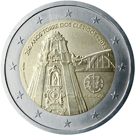

# Portugal € 2.00

## Images

## Metadata

**Country:** [Portugal](../../Countries/Portugal/index.md)\
**Monetary value:** € 2.00\
**Currency:** Euro

## Description
The 250th anniversary of the construction of ‘Torre dos Clérigos’

## Mintages

| Year | Mintmark | Circulated | Brilliant Uncirculated | Proof |
| ---- | -------- | ---------- | ---------------------- | ----- |
| 2013 | | 0 | 0 | 0 |
