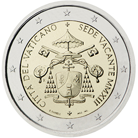

# Vatican City € 2.00

## Images

## Metadata

**Country:** [Vatican City](../../Countries/Vatican City/index.md)\
**Monetary value:** € 2.00\
**Currency:** Euro

## Description

Sede Vacante 2013

## Mintages

| Year | Mintmark | Circulated | Brilliant Uncirculated | Proof |
| ---- | -------- | ---------- | ---------------------- | ----- |
| 2013 |          | 12500      | 0                      | 0     |
