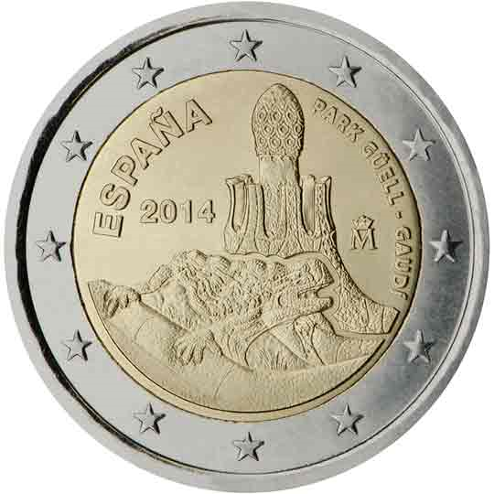

# Spain € 2.00

## Images

## Metadata

**Country:** [Spain](../../Countries/Spain/index.md)\
**Monetary value:** € 2.00\
**Currency:** Euro

## Description
UNESCO's World Cultural and Natural Heritage Sites — Park Güell

## Mintages

| Year | Mintmark | Circulated | Brilliant Uncirculated | Proof |
| ---- | -------- | ---------- | ---------------------- | ----- |
| 2014 | | 0 | 0 | 0 |
