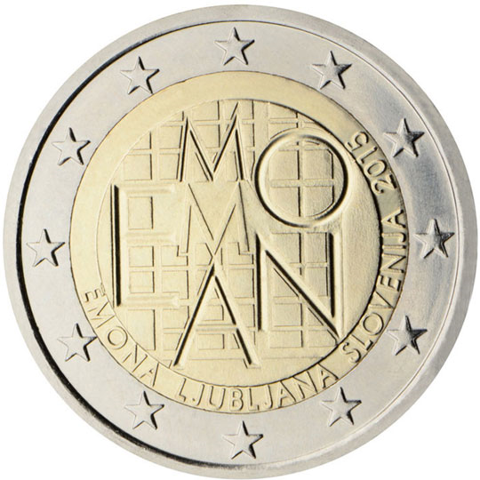

# Slovenia € 2.00

## Images

## Metadata

**Country:** [Slovenia](../../Countries/Slovenia/index.md)\
**Monetary value:** € 2.00\
**Currency:** Euro\
**Issue date:** 2015-11-09\
**Designer:** Matej Ramšak

## Description

Emona-Ljubljana

## Mintages

| Year | Mintmark | Circulated | Brilliant Uncirculated | Proof |
| ---- | -------- | ---------- | ---------------------- | ----- |
| 2015 |          | 980000     |                        | 5000  |

### Sources

- [Mintages](https://www.bsi.si/en/cash/numismatics/emona-ljubljana-2015)
- [Release Date](https://www.bsi.si/en/cash/numismatics/emona-ljubljana-2015)
- [Designer](https://www.bsi.si/en/cash/numismatics/emona-ljubljana-2015)
