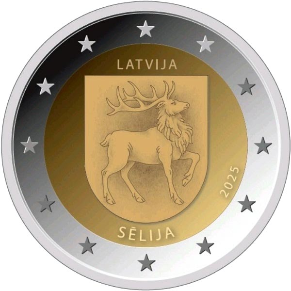

# Latvia € 2.00

## Images

## Metadata

**Country:** [Latvia](../../Countries/Latvia/index.md)\
**Serie:** [Latvian Regions](index.md)\
**Monetary value:** € 2.00\
**Currency:** Euro\
**Issue date:** 2025-10-09\
**Designer:** Laimonis Šēnbergs

## Description

Selonia

## Mintages

| Year | Mintmark | Circulated | Brilliant Uncirculated | Proof |
| ---- | -------- | ---------- | ---------------------- | ----- |
| 2025 |          | 400000     | 7000                   | 0     |

### Sources

[Issue date](https://www.bank.lv/en/news-and-events/news-and-articles/news/17349-latvijas-banka-will-issue-a-2-euro-commemorative-coin-selija)\
[Designer](https://www.bank.lv/en/news-and-events/news-and-articles/news/17349-latvijas-banka-will-issue-a-2-euro-commemorative-coin-selija)\
[Mintages](https://www.bank.lv/en/news-and-events/news-and-articles/news/17349-latvijas-banka-will-issue-a-2-euro-commemorative-coin-selija)
