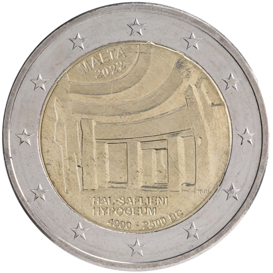

# Malta € 2.00

## Images

## Metadata

**Country:** [Malta](../../Countries/Malta/index.md)\
**Serie:** [Maltese Temples](index.md)\
**Monetary value:** € 2.00\
**Currency:** Euro\
**Issue date:** 2022-11-17\
**Designer:** Noel Galea Bason

## Description

UNESCO: Ħal Saflieni Hypogeum

## Mintages

| Year | Mintmark | Circulated | Brilliant Uncirculated | Proof |
| ---- | -------- | ---------- | ---------------------- | ----- |
| 2022 |          | 0          | 170000                 | 0     |

### Sources

[Issue date](https://www.centralbankmalta.org/site/Currency/EUR2-Commemorative-Coins-EN.pdf?revcount=3728)\
[Designer](https://www.centralbankmalta.org/site/Currency/EUR2-Commemorative-Coins-EN.pdf?revcount=3728)\
[Mintages](https://www.centralbankmalta.org/en/commemorative-coins-2022-hal-saflieni)
