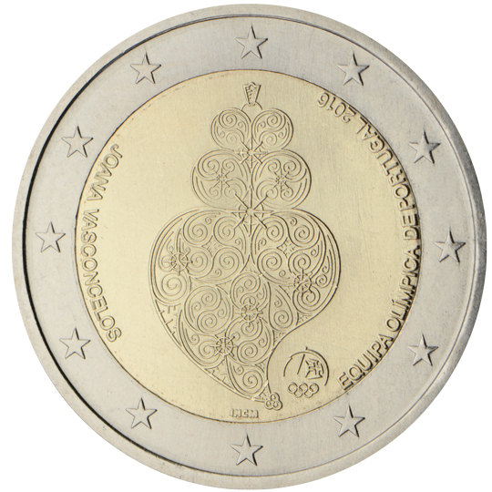

# Portugal € 2.00

## Images

## Metadata

**Country:** [Portugal](../../Countries/Portugal/index.md)\
**Monetary value:** € 2.00\
**Currency:** Euro

## Description

Portuguese team participating in the Rio 2016 Olympic Games

## Mintages

| Year | Mintmark | Circulated | Brilliant Uncirculated | Proof |
| ---- | -------- | ---------- | ---------------------- | ----- |
| 2016 |          | 510000     | 0                      | 10000 |
