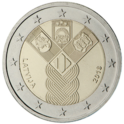

# Latvia € 2.00

## Images

## Metadata

**Country:** [Latvia](../../Countries/Latvia/index.md)\
**Monetary value:** € 2.00\
**Currency:** Euro

## Description
Estonia, Latvia and Lithuania jointly issued a commemorative euro coin with a common design in 2018, celebrating the establishment of the States of Estonia and Latvia and the re-establishment of the State of Lithuania

## Mintages

| Year | Mintmark | Circulated | Brilliant Uncirculated | Proof |
| ---- | -------- | ---------- | ---------------------- | ----- |
| 2018 | | 0 | 0 | 0 |
