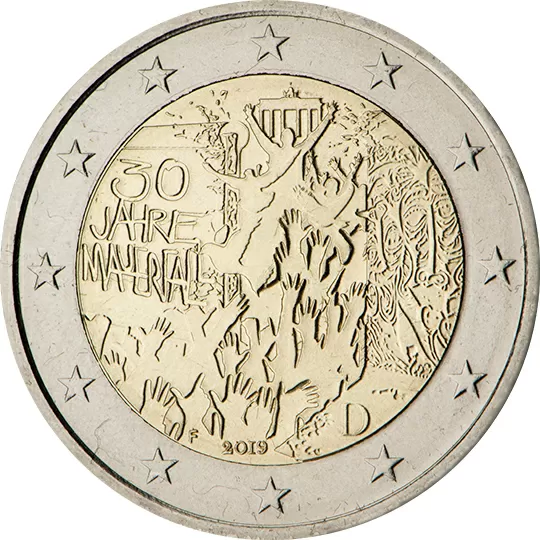

# Germany € 2.00

## Images

## Metadata

**Country:** [Germany](../../Countries/Germany/index.md)\
**Serie:** [Fall of the Berlin Wall](index.md)\
**Monetary value:** € 2.00\
**Currency:** Euro

## Description

The 30th anniversary of the fall of the Berlin wall

## Mintages

| Year | Mintmark | Circulated | Brilliant Uncirculated | Proof |
| ---- | -------- | ---------- | ---------------------- | ----- |
| 2013 | A        | 6530000    | 0                      | 33000 |
| 2013 | D        | 4200000    | 0                      | 33000 |
| 2013 | F        | 7840000    | 0                      | 33000 |
| 2013 | G        | 4570000    | 0                      | 33000 |
| 2013 | J        | 6860000    | 0                      | 33000 |
