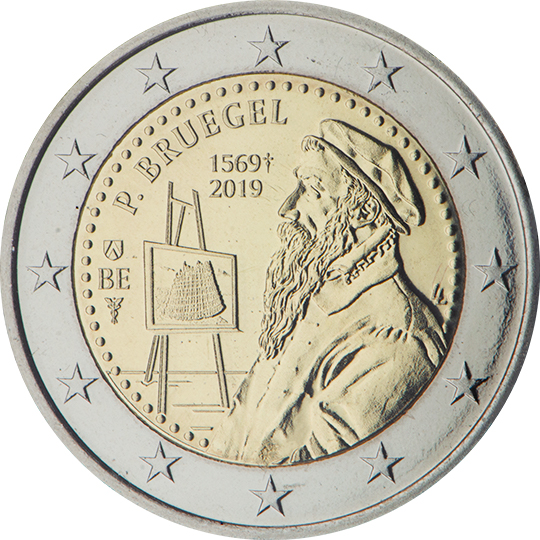

# Belgium € 2.00

## Images

## Metadata

**Country:** [Belgium](../../Countries/Belgium/index.md)\
**Monetary value:** € 2.00\
**Currency:** Euro

## Description

The 450th anniversary of the death of Pieter Bruegel the Elder

## Mintages

| Year | Mintmark | Circulated | Brilliant Uncirculated | Proof |
| ---- | -------- | ---------- | ---------------------- | ----- |
| 2019 |          | 150000     | 0                      | 5500  |
