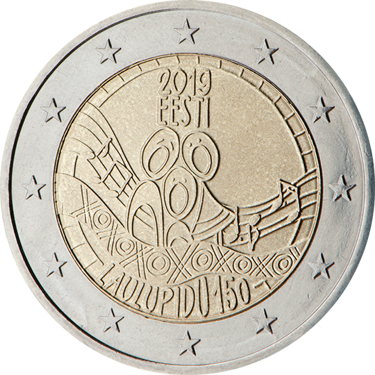

# Estonia € 2.00

## Images

## Metadata

**Country:** [Estonia](../../Countries/Estonia/index.md)\
**Monetary value:** € 2.00\
**Currency:** Euro

## Description
Song Festival’s 150-year anniversary

## Mintages

| Year | Mintmark | Circulated | Brilliant Uncirculated | Proof |
| ---- | -------- | ---------- | ---------------------- | ----- |
| 2019 | | 0 | 0 | 0 |
