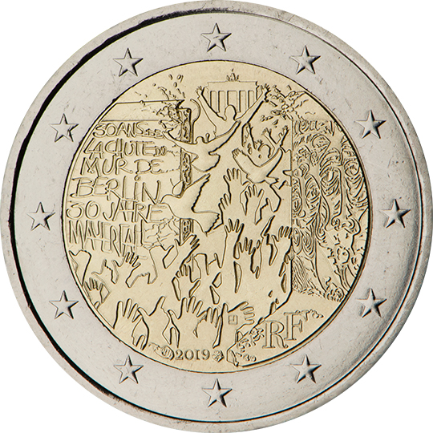

# France € 2.00

## Images

## Metadata

**Country:** [France](../../Countries/France/index.md)\
**Monetary value:** € 2.00\
**Currency:** Euro

## Description

30 years of the fall of the Berlin Wall

## Mintages

| Year | Mintmark | Circulated | Brilliant Uncirculated | Proof |
| ---- | -------- | ---------- | ---------------------- | ----- |
| 2019 |          | 10000000   | 10000                  | 10000 |
