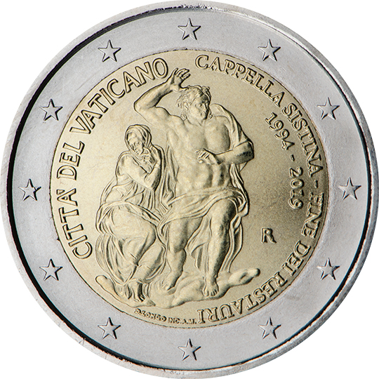

# Vatican € 2.00

## Images

## Metadata

**Country:** [Vatican](../../Countries/Vatican/index.md)\
**Monetary value:** € 2.00\
**Currency:** Euro

## Description
Sistine Chapel — End of the restoration 1994-2019

## Mintages

| Year | Mintmark | Circulated | Brilliant Uncirculated | Proof |
| ---- | -------- | ---------- | ---------------------- | ----- |
| 2019 | | 0 | 0 | 0 |
