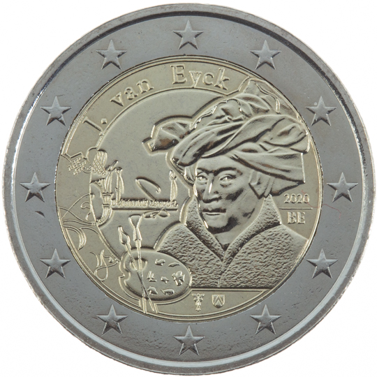

# Belgium € 2.00

## Images

## Metadata

**Country:** [Belgium](../../Countries/Belgium/index.md)\
**Monetary value:** € 2.00\
**Currency:** Euro\
**Issue date:** 2020-10-15\
**Designer:** Luc Luycx

## Description

Jan van Eyck

## Mintages

| Year | Mintmark | Circulated | Brilliant Uncirculated | Proof |
| ---- | -------- | ---------- | ---------------------- | ----- |
| 2020 |          | 0          | 150000                 | 5000  |

### Sources

[Designer](https://finances.belgium.be/sites/default/files/monnaie_info_82.pdf)\
[Mintage BU](https://finances.belgium.be/sites/default/files/monnaie_info_82.pdf)\
[Mintage BU](https://finance.belgium.be/en/issuances-official-assortment-royal-mint-belgium)\
[Mintage Proof](https://finances.belgium.be/sites/default/files/monnaie_info_82.pdf)\
[Mintage Proof](https://finance.belgium.be/en/issuances-official-assortment-royal-mint-belgium)