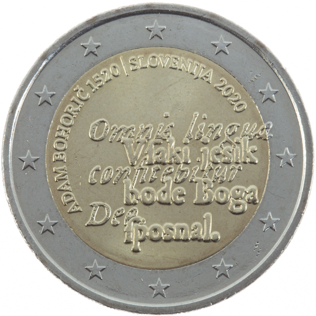

# Slovenia € 2.00

## Images

## Metadata

**Country:** [Slovenia](../../Countries/Slovenia/index.md)\
**Monetary value:** € 2.00\
**Currency:** Euro

## Description

The 500th anniversary of the birth of Adam Bohorič

## Mintages

| Year | Mintmark | Circulated | Brilliant Uncirculated | Proof |
| ---- | -------- | ---------- | ---------------------- | ----- |
| 2020 |          | 0          | 990500                 | 2000  |
