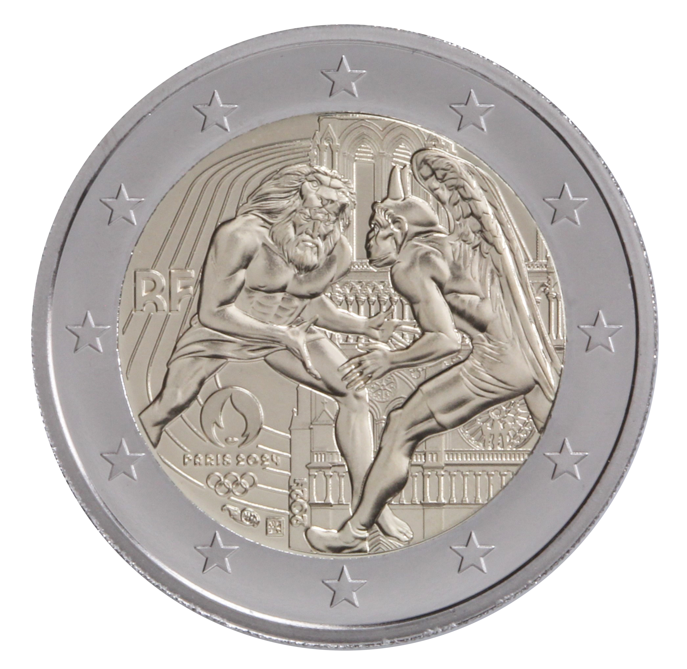

# France € 2.00

## Images

## Metadata

**Country:** [France](../../Countries/France/index.md)\
**Serie:** [2024 Summer Olympics](index.md)\
**Monetary value:** € 2.00\
**Currency:** Euro\
**Issue date:** 2024-01-09

## Description
Jeux Olympiques 2024 - Lutte

## Mintages

| Year | Mintmark | Circulated | Brilliant Uncirculated | Proof |
| ---- | -------- | ---------- | ---------------------- | ----- |
| 2024 |          | 250000     | 0                      | 10000 |
