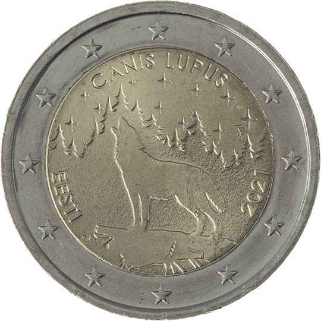

# Estonia € 2.00

## Images

## Metadata

**Country:** [Estonia](../../Countries/Estonia/index.md)\
**Serie:** [Estonian National Symbols](index.md)\
**Monetary value:** € 2.00\
**Currency:** Euro\
**Issue date:** 2021-10-20

## Description
The Estonian national mammal – the wolf

## Mintages

| Year | Mintmark | Circulated | Brilliant Uncirculated | Proof |
| ---- | -------- | ---------- | ---------------------- | ----- |
| 2021 |          | 998000     | 12000                  | 0     |
