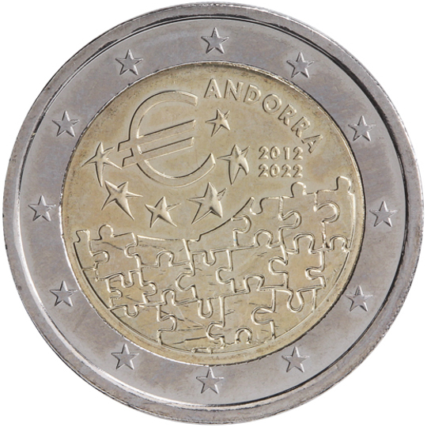

# Andorra € 2.00

## Images

## Metadata

**Country:** [Andorra](../../Countries/Andorra/index.md)\
**Monetary value:** € 2.00\
**Currency:** Euro

## Description
10 years of the entry into force of the Monetary Agreement between Andorra and the European Union

## Mintages

| Year | Mintmark | Circulated | Brilliant Uncirculated | Proof |
| ---- | -------- | ---------- | ---------------------- | ----- |
| 2022 | | 0 | 0 | 0 |
