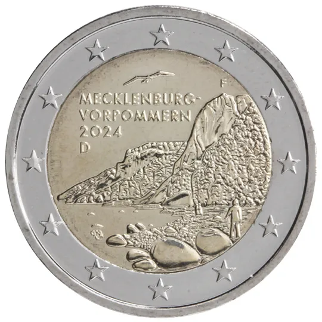

# Germany € 2.00

## Images

## Metadata

**Country:** [Germany](../../Countries/Germany/index.md)\
**Serie:** [German federal states II](index.md)\
**Monetary value:** € 2.00\
**Currency:** Euro

## Description

Federal state of Mecklenburg-Vorpommern

## Mintages

| Year | Mintmark | Circulated | Brilliant Uncirculated | Proof |
| ---- | -------- | ---------- | ---------------------- | ----- |
| 2024 | A | 0| 0 | 0 |
| 2024 | D | 0| 0 | 0 |
| 2024 | F | 0| 0 | 0 |
| 2024 | G | 0| 0 | 0 |
| 2024 | J | 0| 0 | 0 |
