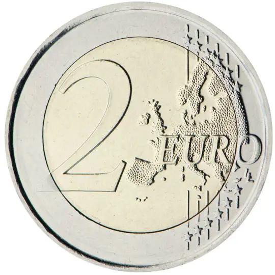

# Germany € 2.00

## Images

## Metadata

**Country:** [Germany](../../Countries/Germany/index.md)\
**Serie:** [German federal states II](index.md)\
**Monetary value:** € 2.00\
**Currency:** Euro\
**Issue date:** 2027-01-26\
**Designer:** Carsten Wolff

## Description

Federal state of North Rhine-Westphalia (Aachen Cathedral)/data/data/com.termux/files/usr/bin/sh: 1: wq: not found

## Mintages

/data/data/com.termux/files/usr/bin/sh: 1: q: not found
| Year | Mintmark | Circulated | Brilliant Uncirculated | Proof |
| ---- | -------- | ---------- | ---------------------- | ----- |
| 2027 | A        | 0          | 0                      | 0     |
| 2027 | D        | 0          | 0                      | 0     |
| 2027 | F        | 0          | 0                      | 0     |
| 2027 | G        | 0          | 0                      | 0     |
| 2027 | J        | 0          | 0                      | 0     |

### Sources

- [Issue Date](https://shop.muenze-deutschland.de/Blog/Praegende-Muenzen/Jahresprogramm-2027/)
