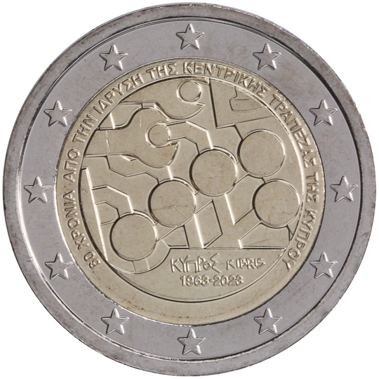

# Cyprus € 2.00

## Images

## Metadata

**Country:** [Cyprus](../../Countries/Cyprus/index.md)\
**Monetary value:** € 2.00\
**Currency:** Euro

## Description
The 60th anniversary of the foundation of the Central Bank of Cyprus

## Mintages

| Year | Mintmark | Circulated | Brilliant Uncirculated | Proof |
| ---- | -------- | ---------- | ---------------------- | ----- |
| 2023 | | 0 | 0 | 0 |
