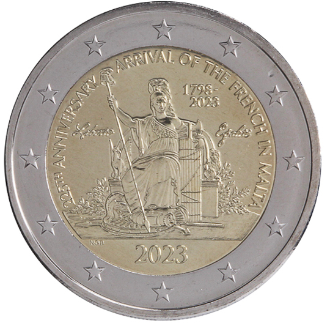

# Malta € 2.00

## Images

## Metadata

**Country:** [Malta](../../Countries/Malta/index.md)\
**Monetary value:** € 2.00\
**Currency:** Euro\
**Issue date:** 2023-09-18\
**Designer:** Noel Galea Bason

## Description

The arrival of the French in Malta in 1798

## Mintages

| Year | Mintmark | Circulated | Brilliant Uncirculated | Proof |
| ---- | -------- | ---------- | ---------------------- | ----- |
| 2023 |          | 5000       | 80500                  | 0     |

### Sources

[Issue date](https://www.centralbankmalta.org/site/Currency/EUR2-Commemorative-Coins-EN.pdf?revcount=3728)\
[Designer](https://www.centralbankmalta.org/site/Currency/EUR2-Commemorative-Coins-EN.pdf?revcount=3728)\
[Mintages](https://www.centralbankmalta.org/site/excel/Currency/Coin-Circulation-Production.xlsx?revcount=1058&revcount=6438)
