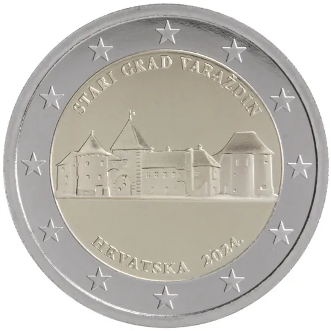

# Croatia € 2.00

## Images

## Metadata

**Country:** [Croatia](../../Countries/Croatia/index.md)\
**Serie:** [Croatian Cities](index.md)\
**Monetary value:** € 2.00\
**Currency:** Euro\
**Issue date:** 2024-07-02\
**Designer:** Stjepan Divković

## Description

Varaždin (Stari grad Varaždin – the Old Town of Varaždin)

## Mintages

| Year | Mintmark | Circulated | Brilliant Uncirculated | Proof |
| ---- | -------- | ---------- | ---------------------- | ----- |
| 2024 |          | 50000      | 200000                 | 5000  |
