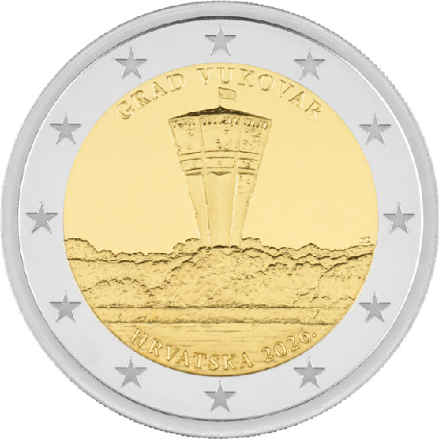

# Croatia € 2.00

## Images

## Metadata

**Country:** [Croatia](../../Countries/Croatia/index.md)\
**Serie:** [Croatian Cities](index.md)\
**Monetary value:** € 2.00\
**Currency:** Euro\
**Issue date:** 2026-09-21\x``
**Designer:**Duje Matetic

## Description

Vukovar

## Mintages

| Year | Mintmark | Circulated | Brilliant Uncirculated | Proof |
| ---- | -------- | ---------- | ---------------------- | ----- |
| 2026 |          | 490000     | 5000                   | 5000  |

- [Mintage Circulated](https://narodne-novine.nn.hr/clanci/sluzbeni/2026_09_105_1276.html)
- [Mintage BU](https://narodne-novine.nn.hr/clanci/sluzbeni/2026_09_105_1276.html)
- [Mintage Proof](https://narodne-novine.nn.hr/clanci/sluzbeni/2026_09_105_1276.html)
- [Issue Date](https://narodne-novine.nn.hr/clanci/sluzbeni/2026_09_105_1276.html)
- [Designer](https://narodne-novine.nn.hr/clanci/sluzbeni/2026_09_105_1276.html)
