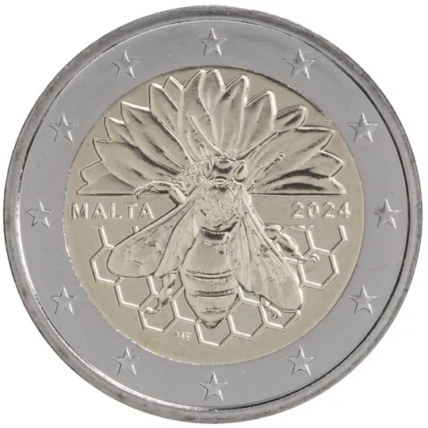

# Malta � 2.00

## Images

## Metadata

**Country:** [Malta](../../Countries/Malta/index.md)\
**Serie:** [Maltese Native Species](index.md)\
**Monetary value:** � 2.00
**Currency:** Euro\
**Issue date:** 2024-08-26\
**Designer:** Maria Anna Frisone

## Description

The Maltese Honey Bee

## Mintages

| Year | Mintmark | Circulated | Brilliant Uncirculated | Proof |
| ---- | -------- | ---------- | ---------------------- | ----- |
| 2024 |          | 0          | 80000                  | 0     |

### Sources

[Issue date](https://www.centralbankmalta.org/site/Currency/EUR2-Commemorative-Coins-EN.pdf?revcount=3728)\
[Designer](https://www.centralbankmalta.org/site/Currency/EUR2-Commemorative-Coins-EN.pdf?revcount=3728)\
[Mintages](https://www.centralbankmalta.org/2024-maltese-honey-bee)
