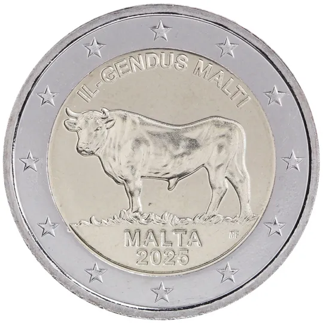

# Malta € 2.00

## Images

## Metadata

**Country:** [Malta](../../Countries/Malta/index.md)\
**Serie:** [Maltese Native Species](index.md)\
**Monetary value:** € 2.00\
**Currency:** Euro\
**Issue date:** 2025-05-15\
**Designer:** Maria Anna Frisone

## Description

Maltese Beef

## Mintages

| Year | Mintmark | Circulated | Brilliant Uncirculated | Proof |
| ---- | -------- | ---------- | ---------------------- | ----- |
| 2025 |          | 0          | 44000                 | 0     |

### Sources

[Issue date](https://www.centralbankmalta.org/site/Currency/EUR2-Commemorative-Coins-EN.pdf?revcount=3728)\
[Designer](https://www.centralbankmalta.org/site/Currency/EUR2-Commemorative-Coins-EN.pdf?revcount=3728)\
[Mintages](https://www.centralbankmalta.org/en/2025-maltese-ox)
