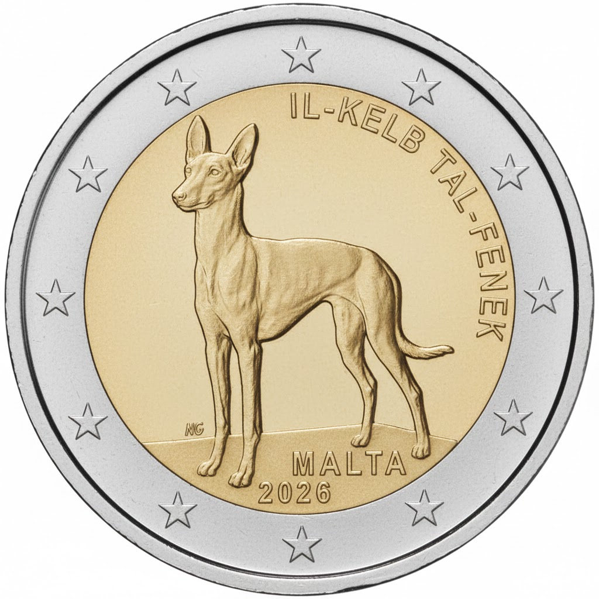

# Malta € 2.00

## Images

## Metadata

**Country:** [Malta](../../Countries/Malta/index.md)\
**Serie:** [Maltese Native Species](index.md)\
**Monetary value:** € 2.00\
**Currency:** Euro\
**Issue date:**\
**Designer:** Maria Anna Frisone

## Description

Pharaoh Hound

## Mintages

| Year | Mintmark | Circulated | Brilliant Uncirculated | Proof |
| ---- | -------- | ---------- | ---------------------- | ----- |
| 2026 |          | 5000       | 105000                 | 3000  |

[Mintages](https://www.centralbankmalta.org/site/excel/Currency/Coin-Circulation-Production.xlsx?revcount=1058&revcount=6438)