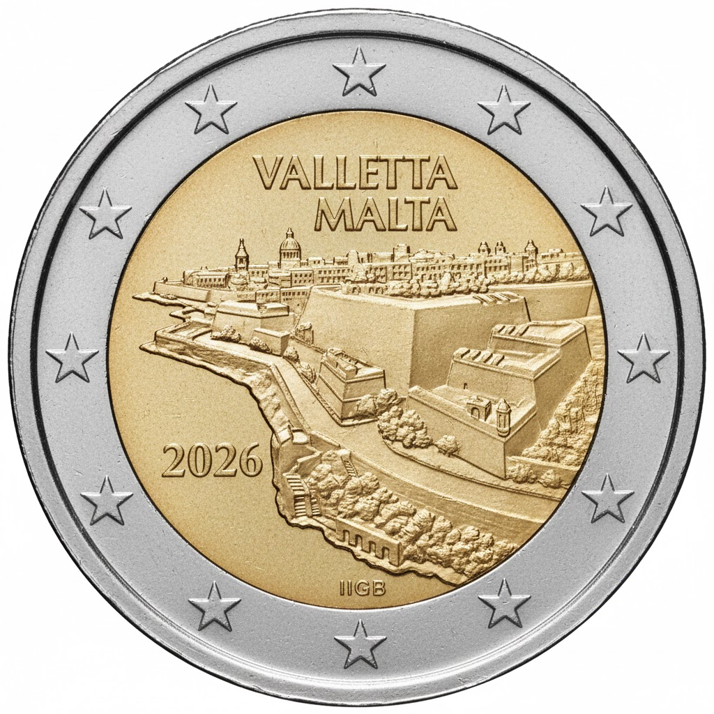

# Malta € 2.00

## Images

## Metadata

**Country:** [Malta](../../Countries/Malta/index.md)\
**Serie:** [Maltese Walled Cities](index.md)\
**Monetary value:** € 2.00\
**Currency:** Euro\
**Issue date:** 2026-05-19\
**Designer:** Noel Galea Bason

## Description

Valleta

## Mintages

| Year | Mintmark | Circulated | Brilliant Uncirculated | Proof |
| ---- | -------- | ---------- | ---------------------- | ----- |
| 2026 |          | 5000       | 105000                 | 3000  |

### Sources

- [Mintages](https://www.centralbankmalta.org/site/excel/Currency/Coin-Circulation-Production.xlsx?revcount=1058&revcount=6438)
- Issue Date [(1, confirmed month)](./Images/Sources/Issue-Date-MT-2026-MWC-200-C.jpg), [(2, estimated date)](https://www.instagram.com/p/DYhpblnjPxG)