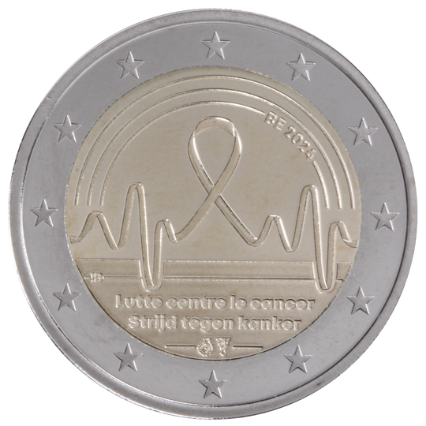

# Belgium € 2.00

## Images

## Metadata

**Country:** [Belgium](../../Countries/Belgium/index.md)\
**Monetary value:** € 2.00\
**Currency:** Euro

## Description
&nbsp;Fight against cancer in BelgiumDescription:&nbsp;The design shows in the centre a ribbon, which is used as a universal symbol to express engagement in the fight against cancer. The shape of the ribbon extends further along the two sides in curved lines, symbolising the movement of a heartbeat on a monitor, as an expression of life and vitality. Three lines can be seen at the top, as a reference to a rainbow (symbolising hope and consolation). Inserted in the bottom line is the country code BE and the year 2024. In the lower part of the piece are inscriptions in French and Dutch: 'Lutte contre le cancer' - 'Strijd tegen kanker'. The initials of the designer Iris Bruijns are located on the left side above the inscriptions. As the Royal Dutch Mint will strike the coins, the mintmark of Utrecht, a mercury staff is located at the very bottom of the piece, together with the Belgian mint director mintmark, an aster flower in front of an Erlenmeyer flask. The coin’s outer ring bears the 12 stars of the European flag.Issuing volume:&nbsp;2 130 000 coinsIssuing date: May 2024

## Mintages

| Year | Mintmark | Circulated | Brilliant Uncirculated | Proof |
| ---- | -------- | ---------- | ---------------------- | ----- |
| 2024 | | 0 | 0 | 0 |
