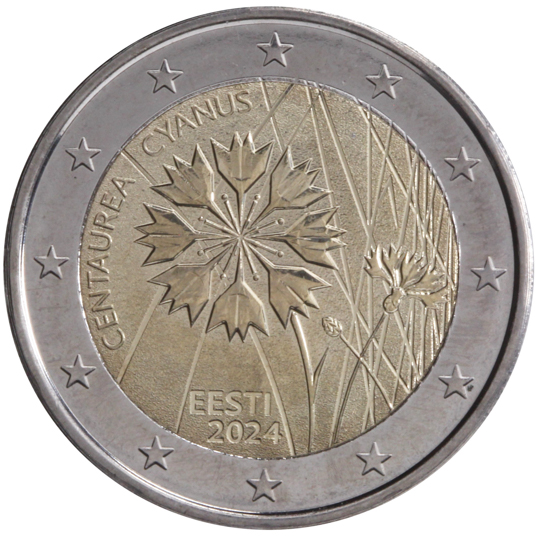

# Estonia € 2.00

## Images

## Metadata

**Country:** [Estonia](../../Countries/Estonia/index.md)\
**Monetary value:** € 2.00\
**Currency:** Euro

## Description
&nbsp; The cornflower – Estonian national flowerDescription:&nbsp;The design shows the silhouette of a cornflower with the text ‘CENTAUREA CYANUS’ (cornflower in Latin) at the top left, in semi-circle. At the bottom is the name of the issuing country ‘EESTI’ and underneath the year of issuance ‘2024’. The coin’s outer ring bears the 12 stars of the European flag.Issuing volume: 1 000 000 coinsIssuing date:&nbsp;Second quarter 2024

## Mintages

| Year | Mintmark | Circulated | Brilliant Uncirculated | Proof |
| ---- | -------- | ---------- | ---------------------- | ----- |
| 2024 | | 0 | 0 | 0 |
