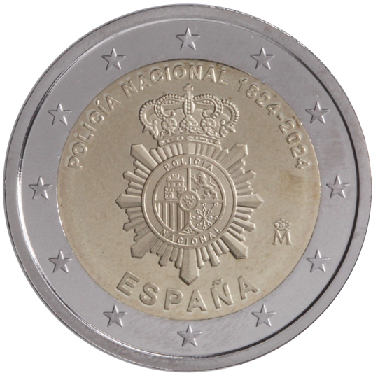

# Spain € 2.00

## Images

## Metadata

**Country:** [Spain](../../Countries/Spain/index.md)\
**Monetary value:** € 2.00\
**Currency:** Euro

## Description
&nbsp;200 years since the creation of the National Police as a state security corpDescription: The design shows the emblem of the National Police. Surrounding it are the legends: ‘ESPANA- POLICIA NACIONAL 1824-2024’. In the lower right part of the emblem is the mint mark ‘Eme Coronada’. The coin’s outer ring bears the 12 stars of the European flag.Issuing volume:&nbsp;1 500 000 coins

## Mintages

| Year | Mintmark | Circulated | Brilliant Uncirculated | Proof |
| ---- | -------- | ---------- | ---------------------- | ----- |
| 2024 | | 0 | 0 | 0 |
