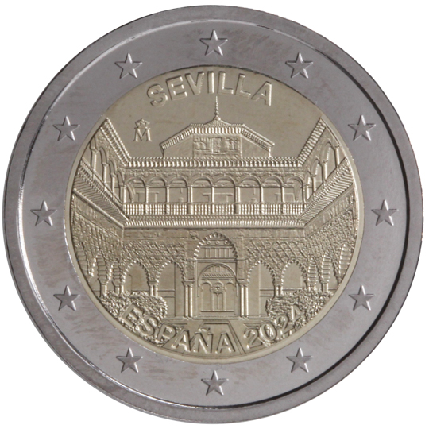

# Spain € 2.00

## Images

## Metadata

**Country:** [Spain](../../Countries/Spain/index.md)\
**Monetary value:** € 2.00\
**Currency:** Euro

## Description
&nbsp;The recognition of Seville (Archivo de Indias, Real Alcazar de Sevilla y Catedral de Sevilla) as a UNESCO World Heritage SiteDescription:&nbsp;The design shows a view of the ‘Patio de las Doncellas’ of the Real Alcåzar of Seville. At the top, in a circular direction and in capital letters, the legend SEVILLA; below, the mint mark ‘Eme Coronada’. At the bottom, in a circular direction and in capital letters, the legend ESPANA and the year of issue 2024. The coin’s outer ring bears the 12 stars of the European flag.

## Mintages

| Year | Mintmark | Circulated | Brilliant Uncirculated | Proof |
| ---- | -------- | ---------- | ---------------------- | ----- |
| 2024 | | 0 | 0 | 0 |
