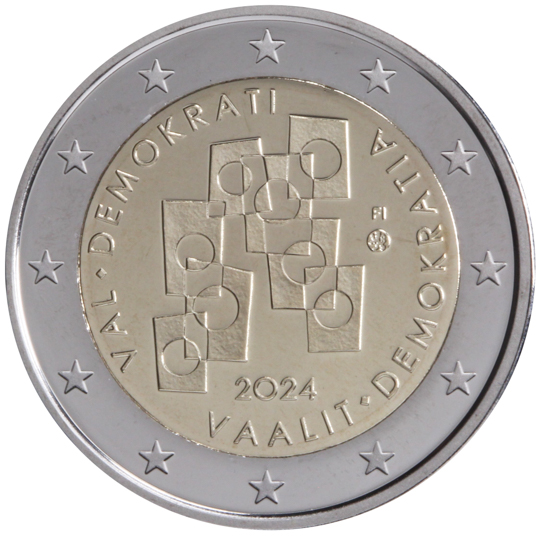

# Finland € 2.00

## Images

## Metadata

**Country:** [Finland](../../Countries/Finland/index.md)\
**Monetary value:** € 2.00\
**Currency:** Euro

## Description
&nbsp;Elections and democracyDescription:&nbsp;The design shows stylized ballots. Ballots consist of circles and rectangles. The subject is abstract, but still recognizable. There are eight ballots, and they are partially overlapped, creating smaller geometric shapes at the intersections of the overlapping tickets. The year 2024 is at the bottom. The lettering ‘FI’ is on the right-hand side slightly above the midline. The text VAALIT ♦ DEMOKRATIA rotates on the right-hand side of the money ring. The text VAL ♦ DEMOKRATI is circling the coin on the left-hand side. The coin’s outer ring bears the 12 stars of the European flag.Issuing volume:&nbsp;400 000 coinsIssuing date: Spring 2024

## Mintages

| Year | Mintmark | Circulated | Brilliant Uncirculated | Proof |
| ---- | -------- | ---------- | ---------------------- | ----- |
| 2024 | | 0 | 0 | 0 |
