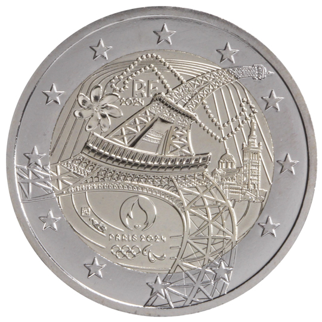

# France € 2.00

## Images

## Metadata

**Country:** [France](../../Countries/France/index.md)\
**Monetary value:** € 2.00\
**Currency:** Euro

## Description
&nbsp; The Eiffel TowerDescription:&nbsp;For the countdown to the Paris 2024 Olympic Games, Monnaie de Paris celebrates the road to the games through Paris as well as its own heritage. 100 years after the 1924 Games, the French capital is once again hosting the Summer Games. This is an event with international resonance, gradually building in intensity in the years leading up to the event, culminating in 2024 with the issue of two commemorative two-euro coins dedicated to the Olympic Games. The design represents an expression of France through iconic buildings; the Eiffel Tower and the Notre Dame de la Garde Basilica situated in Marseille are united there. In the background, a tiare flower represents the island of Tahiti where the surfing competitions will take place. The Eiffel Tower is in motion, she carries the values of sport. Its arms are represented by 73 rivets signifying the host communities. For the first time, the Olympic and Paralympic symbols are brought together, to celebrate the Games for all. The year date, the indication of the issuing country ‘RF’ as well as the mintmarks are inserted on the athletics track.&nbsp;The coin’s outer ring bears the 12 stars of the European flag.Issuing volume: 24 000 000 coinsIssuing date: May 2024

## Mintages

| Year | Mintmark | Circulated | Brilliant Uncirculated | Proof |
| ---- | -------- | ---------- | ---------------------- | ----- |
| 2024 | | 0 | 0 | 0 |
