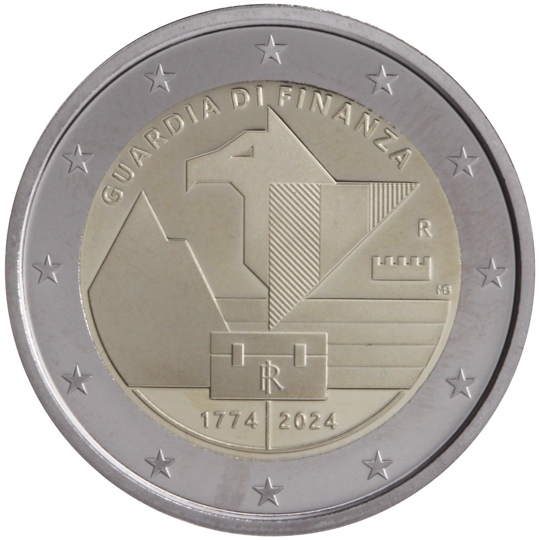

# Italy € 2.00

## Images

## Metadata

**Country:** [Italy](../../Countries/Italy/index.md)\
**Monetary value:** € 2.00\
**Currency:** Euro

## Description
&nbsp;The 250th anniversary of the foundation of the Guardia di Finanza CorpsDescription:&nbsp; The design depicts, in the centre, a stylized version of the heraldic symbol of Guardia di Finanza Corps: it portrays the concept of security and provides a future vision of the Corps’ role celebrating the past, by combining it with the years to come and challenges they will continue to face. This emblem includes different elements: mountain, sea and the sky, which are the natural environments where Corps operate; the Griffon, a mythological animal which, according to the legend, supervises protection of the Treasury, represented by the chest of the State, and the turreted crown. At the top, in semi-circle, is the inscription ‘GUARDIA DI FINANZA’. Below, ‘RI’, acronym of the Italian Republic and the dates ‘1774-2024’, year of the establishment of the Guardia di Finanza Corps and year of coin’s issue respectively; on the right, ‘R’, identifying the Mint of Rome and ‘MB’, the initials of designer Marta Bonifacio. The coin’s outer ring bears the 12 stars of the European flag.Issuing volume:&nbsp;3 000 000 coinsIssuing date:&nbsp;January 2024

## Mintages

| Year | Mintmark | Circulated | Brilliant Uncirculated | Proof |
| ---- | -------- | ---------- | ---------------------- | ----- |
| 2024 | | 0 | 0 | 0 |
