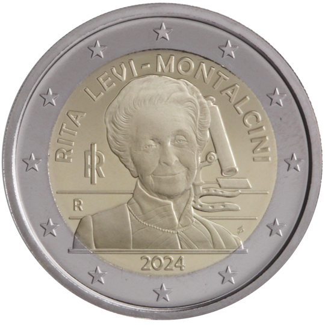

# Italy € 2.00

## Images

## Metadata

**Country:** [Italy](../../Countries/Italy/index.md)\
**Monetary value:** € 2.00\
**Currency:** Euro

## Description
&nbsp;Rita Levi-MontalciniDescription:&nbsp;The design depicts in the foreground, a half-length portrait of Rita Levi-Montalcini inspired by a Manuela Fabbri’s photography; in the background, a microscope, taken from a medal designed by Gino Levi-Montalcini, brother of the well renown scientist, whose base is horseshoe shaped, as a good luck charm for the awarding of the Nobel Prize for Medicine in the 1986. Above, the arch-shaped inscription ‘RITA LEVI-MONTALCINI’; on the left ‘RI’, acronym of the Italian Republic and ‘R’, identifying the Mint of Rome; below ‘2024’, the year of the coin’s issue; on the right, ‘SP’, initials of the designer Silvia Petrassi. The coin’s outer ring bears the 12 stars of the European flag.Issuing volume:&nbsp;3 000 000 coinsIssuing date: January 2024&nbsp;

## Mintages

| Year | Mintmark | Circulated | Brilliant Uncirculated | Proof |
| ---- | -------- | ---------- | ---------------------- | ----- |
| 2024 | | 0 | 0 | 0 |
