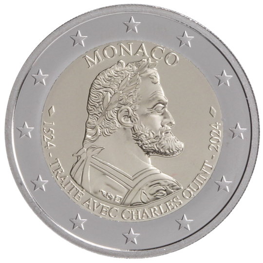

# Monaco € 2.00

## Images

## Metadata

**Country:** [Monaco](../../Countries/Monaco/index.md)\
**Monetary value:** € 2.00\
**Currency:** Euro

## Description
&nbsp;500 years since the signature of the Treaty with Charles VDescription:&nbsp;The design shows the effigy of Charles V. At the top, in semi-circle, is the name of the issuing country ‘MONACO’. At the bottom is the inscription ‘1524 - TRAITE AVEC CHARLES QUINT (Treaty with Charles V) - 2024’. The coin’s outer ring bears the 12 stars of the European flag.Issuing volume:&nbsp;15 000 coinsIssuing date: June 2024

## Mintages

| Year | Mintmark | Circulated | Brilliant Uncirculated | Proof |
| ---- | -------- | ---------- | ---------------------- | ----- |
| 2024 | | 0 | 0 | 0 |
