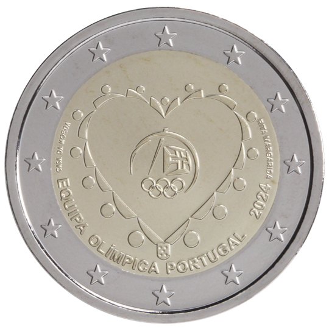

# Portugal € 2.00

## Images

## Metadata

**Country:** [Portugal](../../Countries/Portugal/index.md)\
**Monetary value:** € 2.00\
**Currency:** Euro

## Description
Portugal’s participation in the 33rd Olympic GamesDescription:&nbsp;The design shows a set of elements arranged in the shape of a heart, representing a collective hug; around the heart there are 15 circles in symbolic reference to the Olympic rings and to the continents they represent, the tip of the heart shape is surmounted by the coat of arms of Portugal; the centre of the ‘hug’ holds the logo of the Portuguese Olympic Committee, conveying the idea that the hearts of the Portuguese will collectively beat for the Portuguese Olympic team at the Paris 2024 Olympic Games. Below the heart shape, the caption ‘Equipa Olímpica Portugal’, and the year ‘2024’; on the left the mintmark ‘Casa da Moeda’; and on the right the name of the designer. The coin’s outer ring bears the 12 stars of the European flag.Issuing volume: 520 000 coinsIssuing date: July 2024

## Mintages

| Year | Mintmark | Circulated | Brilliant Uncirculated | Proof |
| ---- | -------- | ---------- | ---------------------- | ----- |
| 2024 | | 0 | 0 | 0 |
