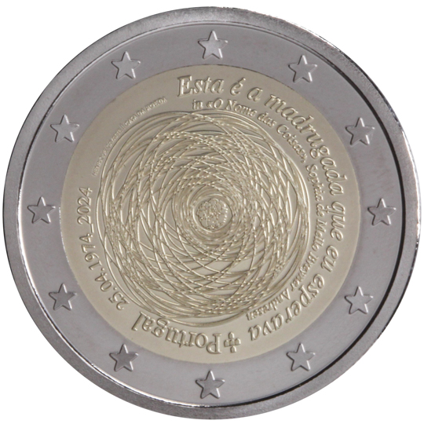

# Portugal € 2.00

## Images

## Metadata

**Country:** [Portugal](../../Countries/Portugal/index.md)\
**Monetary value:** € 2.00\
**Currency:** Euro

## Description
&nbsp;The 50th anniversary of the 25th of April 1974Description:&nbsp;The 25th of April 1974 is the date of the revolution that marked the establishment of the democratic rule in Portugal and the beginning of a journey of profound economic, social and cultural transformations that led to the Europeanization of the country.&nbsp;At the centre of the design, a carnation symbolizes the revolution, surrounded by multiple eccentric circles that suggest that people’s actions and beliefs may change over the years, but remain essentially true to the principles of the revolution. On the edge, on the right, the verse ‘Esta é a madrugada que eu esperava’ [This is the dawn I have been waiting for], and the name of its author, poet ‘Sophia de Mello Breyner Andresen’; and on the left by the national coat of arms, the captions ‘Portugal’ and ‘25 April 1974_2024’, followed by the name of the designer and the mintmark ‘Casa da Moeda’, the name of the Portuguese Mint.&nbsp;The coin’s outer ring bears the 12 stars of the European flag.Issuing volume:&nbsp;515 000 coinsIssuing date: April 2024

## Mintages

| Year | Mintmark | Circulated | Brilliant Uncirculated | Proof |
| ---- | -------- | ---------- | ---------------------- | ----- |
| 2024 | | 0 | 0 | 0 |
