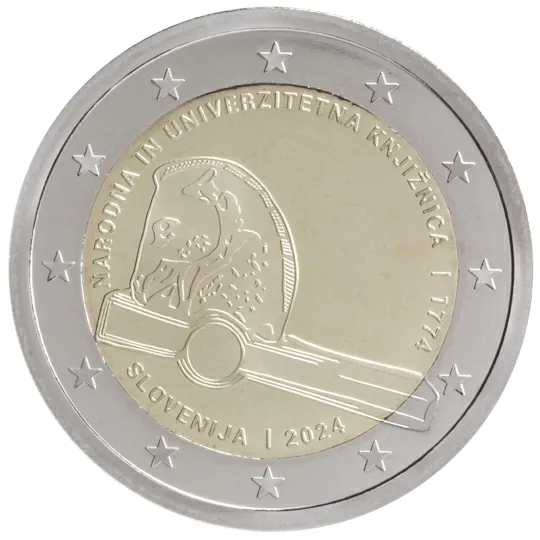

# Slovenia € 2.00

## Images

## Metadata

**Country:** [Slovenia](../../Countries/Slovenia/index.md)\
**Monetary value:** € 2.00\
**Currency:** Euro\
**Issue date:** 2024-12-18

## Description

250th anniversary of the National and University Library

## Mintages

| Year | Mintmark | Circulated | Brilliant Uncirculated | Proof |
| ---- | -------- | ---------- | ---------------------- | ----- |
| 2024 |          | 997500     | 0                      | 2500  |
