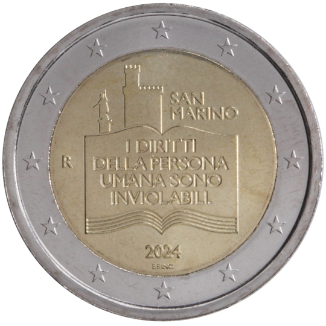

# San Marino € 2.00

## Images

## Metadata

**Country:** [San Marino](../../Countries/San Marino/index.md)\
**Monetary value:** € 2.00\
**Currency:** Euro

## Description
&nbsp;The 50th anniversary of the Declaration of Citizens' Rights and the Fundamental Principles of San MarinoDescription:&nbsp;In the centre is represented an open book bearing the inscription ‘I DIRITTI DELLA PERSONA UMANA SONO INVIOLABILI’ (The rights of the human person are inviolable), taken from Article 5 of the Law n°59 of 8 July 1974 ‘Declaration of Citizens' Rights and of the fundamental principles of the San Marinese legal order’. At the top are the silhouettes of the Statue of Liberty and the Public Palace, as well as the name of the issuing country ‘SAN MARINO’. On the left, the letter ‘R’, identifying the Mint of Rome. At the bottom centre is the year of issuance ‘2024’ and the initials of the engraver Emanuele Ferretti (‘E.F. INC. ’). The coin’s outer ring bears the 12 stars of the European flag.Issuing volume:&nbsp;56 000 coinsIssuing date: April 2024

## Mintages

| Year | Mintmark | Circulated | Brilliant Uncirculated | Proof |
| ---- | -------- | ---------- | ---------------------- | ----- |
| 2024 | | 0 | 0 | 0 |
