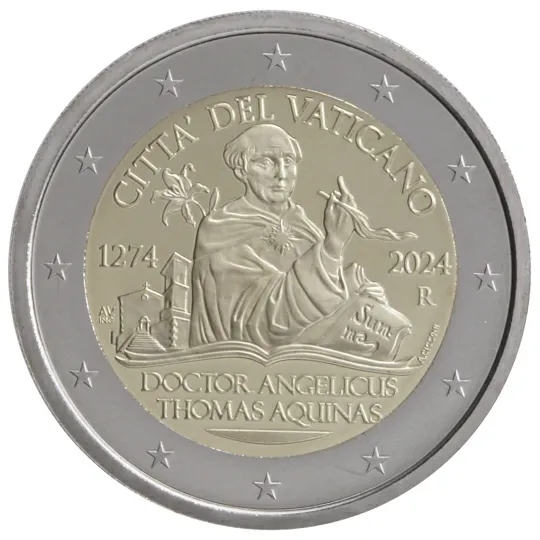

# Vatican € 2.00

## Images

## Metadata

**Country:** [Vatican City](../../Countries/Vatican%20City/index.md)\
**Monetary value:** € 2.00\
**Currency:** Euro\
**Issue date:** 2024-07-03\
**Designer:** Arianna Cicconi

## Description

The 750th anniversary of the Death of Thomas Aquinas

## Mintages

| Year | Mintmark | Circulated | Brilliant Uncirculated | Proof |
| ---- | -------- | ---------- | ---------------------- | ----- |
| 2024 |          | 0          | 67000                  | 9900  |

### Sources

[Issue date](https://www.cfn.va/en/numismatics/985-moneta-commemorativa-da-2-euro-anno-2024-versione-fior-di-conio-750-anniversario-della-morte-di.html)\
[Designer](https://www.cfn.va/en/numismatics/985-moneta-commemorativa-da-2-euro-anno-2024-versione-fior-di-conio-750-anniversario-della-morte-di.html)\
[Mintages BU](https://www.cfn.va/en/numismatics/985-moneta-commemorativa-da-2-euro-anno-2024-versione-fior-di-conio-750-anniversario-della-morte-di.html)\
[Mintages Proof](https://www.cfn.va/en/numismatics/986-morte-di-san-tommaso-d-aquino.html)
