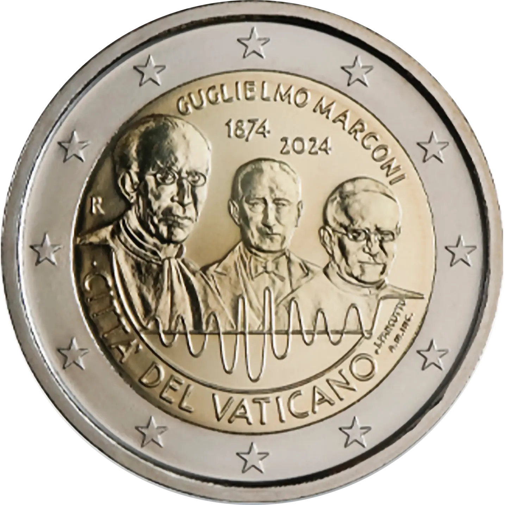

# Vatican € 2.00

## Images

## Metadata

**Country:** [Vatican City](../../Countries/Vatican%20City/index.md)\
**Monetary value:** € 2.00\
**Currency:** Euro\
**Issue date:** 2024-11-12\
**Designer:** Loredana Pancotto

## Description

The 150th anniversary of the birth of Guglielmo Marconi

## Mintages

| Year | Mintmark | Circulated | Brilliant Uncirculated | Proof |
| ---- | -------- | ---------- | ---------------------- | ----- |
| 2024 |          | 0          | 73000                  | 9900  |

### Sources

[Issue date](https://www.cfn.va/en/numismatics/1019-moneta-2-marconi.html)\
[Designer](https://www.cfn.va/en/numismatics/1019-moneta-2-marconi.html)\
[Mintages BU](https://www.cfn.va/en/numismatics/1019-moneta-2-marconi.html)\
[Mintages Proof](https://www.cfn.va/en/numismatics/1020-moneta-2-euro-marconi.html)
