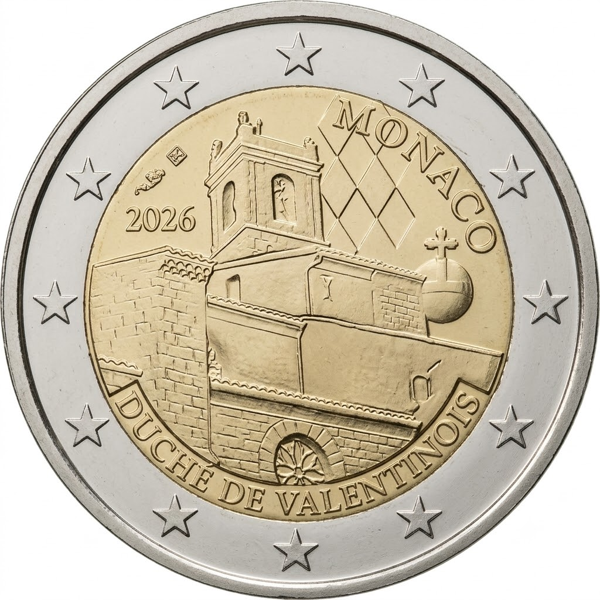

# Monaco € 2.00

## Images

## Metadata

**Country:** [Monaco](../../Countries/Monaco/index.md)\
**Monetary value:** € 2.00\
**Currency:** Euro\
**Issue date:** 2026-06-16\
**Designer:** 

## Description

Duché de Valentinois

## Mintages

| Year | Mintmark | Circulated | Brilliant Uncirculated | Proof |
| ---- | -------- | ---------- | ---------------------- | ----- |
| 2026 |          | 0          | 0                      | 15000 |
